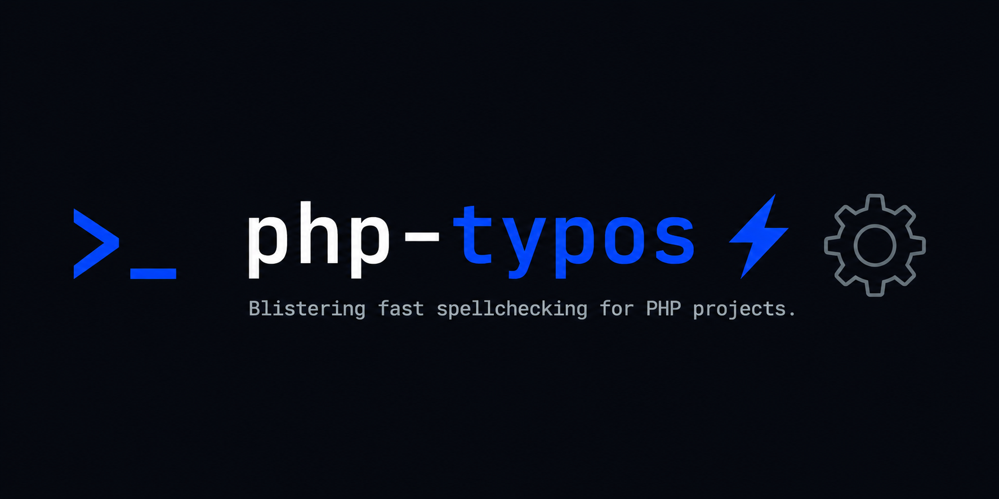

<picture>
    <source media="(prefers-color-scheme: dark)" srcset="art/header-dark.png">
    
</picture>

<p align="center">
    <p align="center">
        <a href="https://github.com/chr15k/php-typos/actions"></a>
        <a href="https://packagist.org/packages/chr15k/php-typos"></a>
        <a href="https://packagist.org/packages/chr15k/php-typos"></a>
        <a href="https://packagist.org/packages/chr15k/php-typos"></a>
    </p>
</p>

------

# Typos for PHP

A blistering fast source code spellchecker for PHP projects, powered by the [typos](https://github.com/crate-ci/typos) Rust CLI.

The correct platform binary ships with the package — no Rust, Cargo, or Homebrew required. Run it the same way you run Pint or PHPStan, and it works the same way in CI.

---

## Requirements

- PHP 8.3+
- Linux (x86_64 / ARM64), macOS (x86_64 / ARM64), or Windows (x86_64)

---

## Installation

Install as a development dependency:

```bash
composer require chr15k/php-typos --dev
```

Then initialise a configuration file in your project root:

```bash
./vendor/bin/typos --init
```

This copies a `_typos.toml` file to your project root where you can configure paths to exclude and words to ignore.

---

## Usage

### Basic check

Scan the entire project from the current directory:

```bash
./vendor/bin/typos
```

Scan specific paths:

```bash
./vendor/bin/typos app/
./vendor/bin/typos app/ tests/ config/
```

---

## Flags

### `--init` / `-i`

Copies the default `_typos.toml` configuration file into your project root. Safe to run on a fresh project — it will not overwrite an existing config.

```bash
./vendor/bin/typos --init
```

---

### `--write` / `-w`

Automatically fix discovered typos by writing corrections directly to the affected files.

```bash
./vendor/bin/typos --write
./vendor/bin/typos src/ --write
```

> Cannot be used together with `--diff`.

---

### `--diff` / `-d`

Show a unified diff of proposed corrections without modifying any files. Useful for reviewing what `--write` would change before committing to it.

```bash
./vendor/bin/typos --diff
./vendor/bin/typos src/ --diff
```

> Cannot be used together with `--write`.

---

### `--files` / `-fi`

List the files being scanned without checking for typos.

```bash
./vendor/bin/typos --files
./vendor/bin/typos src/ --files
```

---

### `--identifiers` / `-id`

List all identifiers (variable names, function names, etc.) found during the scan.

```bash
./vendor/bin/typos --identifiers
```

---

### `--words` / `-wo`

List all words found during the scan.

```bash
./vendor/bin/typos --words
```

---

### `--format` / `-f`

Control the output format. Defaults to `long`.

| Value   | Description                                              |
|---------|----------------------------------------------------------|
| `long`  | Full output with file path, line, and correction detail (default) |
| `brief` | One line per file with typos                             |
| `json`  | Machine-readable JSON, suitable for CI annotation tools  |

```bash
./vendor/bin/typos --format=json
./vendor/bin/typos --format=brief
```

---

### `--config` / `-c`

Path to a custom `_typos.toml` configuration file. Defaults to the one in your project root.

```bash
./vendor/bin/typos --config=path/to/_typos.toml
```

---

## Configuration

The `_typos.toml` file controls which paths are excluded and which words are globally ignored.

```toml
[files]
extend-exclude = [
    "vendor",
    "node_modules",
    "bootstrap/cache",
    "storage",
    ".git",
    "public"
]

[default.extend-words]
# Words to skip globally (key and value must match)
# creeate = "creeate"
```

---

## CI/CD Integration

### GitHub Actions

```yaml
- name: Check for typos
  run: ./vendor/bin/typos
```

For annotation-friendly output:

```yaml
- name: Check for typos
  run: ./vendor/bin/typos --format=json
```

### Composer script

Add a script to your `composer.json` to run alongside your other checks:

```json
"scripts": {
    "typos:check": "typos",
    "ci": [
        "@lint:check",
        "@refactor:check",
        "@types:check",
        "@typos:check",
        "@unit"
    ],
}
```

---

## Supported Platforms

| OS      | Architecture |
|---------|-------------|
| macOS   | x86_64, ARM64 (Apple Silicon) |
| Linux   | x86_64, ARM64 |
| Windows | x86_64 |

---

## License

MIT — see [LICENSE](LICENSE) for details.